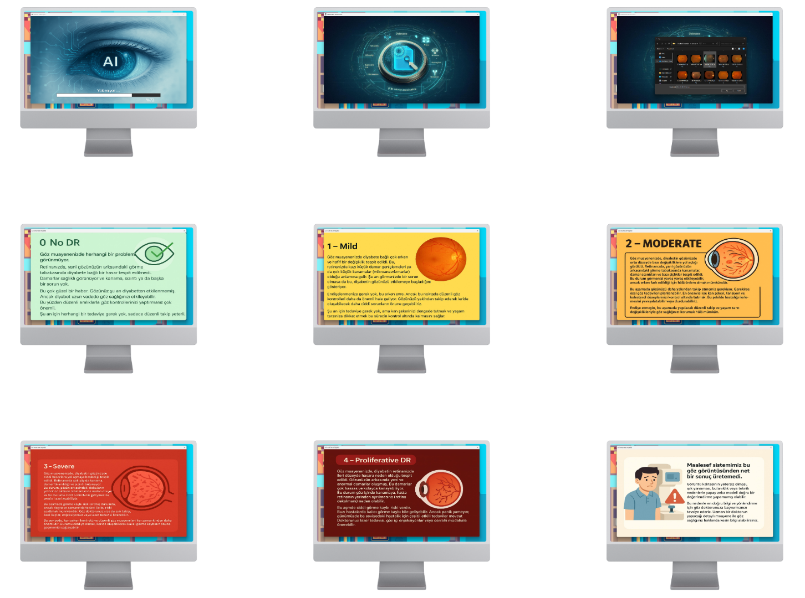

# Blindless Detection

## About the Project

**Blindless Detection** is a desktop application that classifies retinal images into five diabetic retinopathy stages using a machine learning model trained on the APTOS 2019 Blindness Detection dataset.

Unlike many image classifiers, this application prioritizes reliability: if the model's confidence in its prediction falls below a predefined threshold, it shows a "result not found" screen instead of potentially returning an incorrect label.

The classification levels are:

- **0 — No DR**: No signs of diabetic retinopathy  
- **1 — Mild**: Early signs such as microaneurysms  
- **2 — Moderate**: More severe lesions without immediate vision threat  
- **3 — Severe**: Significant damage with high progression risk  
- **4 — Proliferative DR**: Advanced stage with high risk of vision loss

  

## How It Works

1. **Image Selection**  
   The user selects a retinal image from their device.

2. **Model Inference**  
   The image is analyzed using an embedded machine learning model trained on the APTOS 2019 Blindness Detection dataset. The model predicts one of the five diabetic retinopathy stages.

3. **Confidence Score Evaluation**  
   The model outputs softmax probabilities for all classes. The class with the highest score is identified and compared to a predefined confidence threshold (%80).

4. **Displaying the Result**  
   - If the confidence score is above the threshold, the predicted class is shown.  
   - If the confidence score is below the threshold, a "Result not found" screen is displayed.

This approach ensures only reliable results are presented, reducing the risk of misclassification.

## Image Preprocessing

Before feeding images to the model, the following preprocessing steps are applied:

- Conversion from BGR to RGB color space  
- Cropping the main retinal area using contour detection  
- Resizing the image to the model input size  
- Applying CLAHE (Contrast Limited Adaptive Histogram Equalization) to enhance contrast  

These steps help the model focus on relevant retinal features and improve classification accuracy.

## Model Architecture

The model is based on the Xception architecture pretrained on ImageNet. The top layers are replaced with:

- Global Average Pooling layer  
- Dropout layer with a rate of 0.3 to reduce overfitting  
- Dense output layer with 5 units and softmax activation  

Input images are resized to `(196, 196, 3)`.

## Technical Details

The model was trained on the APTOS 2019 dataset with image augmentation techniques including:

- Random rotations and flips  
- Brightness and contrast adjustments  
- Zoom and cropping  
- Gaussian noise addition  

These augmentations improve the model’s generalization and prevent overfitting.

## License

This project is licensed under the MIT License. See the [LICENSE](LICENSE) file for details.
